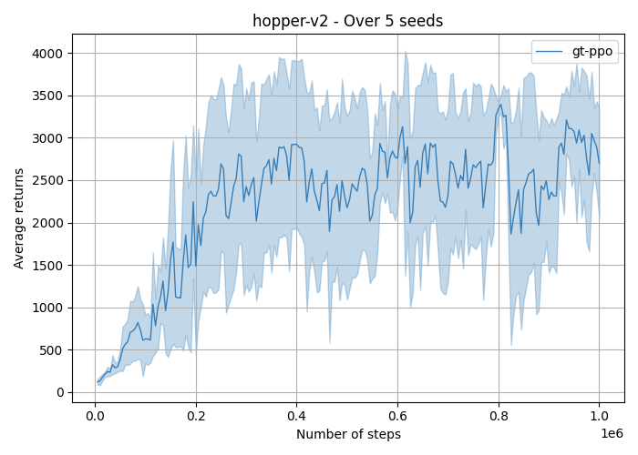
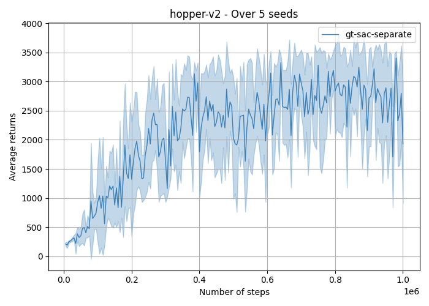

# Reinforcement Learning Sandbox
This repository provides a standardized way to do Reinforcement Learning (RL) training (in PyTorch).  
The implemented algorithms specifically targets continuous control/robotics tasks, but can be 
extended to handle discrete action tasks like Atari and other gaming domains.

## Setup
Conda environment (This will also install MuJoCo and Deepmind Control Suite):
```
cd ${RL_SANDBOX_PATH}
conda env create -f environment.yml
conda activate rl_sandbox
pip install -e ${RL_SANDBOX_PATH}
```

Pip:
```
cd ${RL_SANDBOX_PATH}
pip install -r requirements.txt
pip install -e .
```

## Algorithms
The following is the list of algorithms that this repository currently support:
- Proximal Policy Optimization (PPO): https://arxiv.org/abs/1707.06347
- Soft Actor Critic (SAC): https://arxiv.org/abs/1801.01290
- Scheduled Auxiliary Control (SAC-X): https://arxiv.org/abs/1802.10567
- Diversity is All You Need (DIAYN): https://arxiv.org/abs/1802.06070
- Data-regularized Q (DrQ): https://arxiv.org/abs/2004.13649
- AlgaeDICE: https://arxiv.org/abs/1912.02074
- Discriminator Actor Critic (DAC): https://arxiv.org/abs/1809.02925
- Self-Guided and Self-Regularized Actor-Critic (GRAC): https://arxiv.org/abs/2009.08973

## Replay Buffers
The following is the list of supported experience replay:
- Vanilla
- Prioritized Experience Replay (PER): https://arxiv.org/abs/1511.05952

## Auxiliary Tasks Learning
You may extend the existing algorithms with auxiliary tasks:
- Koopman: This enforces the encoder of the policy to learn a latent space such that the latent dynamic is linear. Really this is just an auxiliary task for learning a linear forward model since we have discrete time.


## Examples
You can find examples for both PPO and SAC under the directory `${RL_SANDBOX_PATH}/rl_sandbox/examples/gym/hopper`. To train an RL agent for MuJoCo Hopper task using PPO:
```
cd ${RL_SANDBOX_PATH}/rl_sandbox/examples/gym/hopper
python ppo_experiment.py --seed=1
```

This will generate a `results/mujoco/hopper-v2/gt-ppo` directory under `gym` directory. It keeps track of the experiment configuration, learning progress, and policies.

**NOTE:** For image based tasks, only DrQ is currently able to achieve performance similar to gt observations with same data efficiency.

## Supported Environments
- Standard Gym Environments: https://github.com/openai/gym
- DeepMind Control Suite: https://github.com/deepmind/dm_control

## Benchmarking Results
Each algorithm is trained for 1 million timesteps, with `seeds=( 1 2 3 4 5 )`. For every 5000 timesteps, we evaluate the agent in a separate copy of the environment and execute 5 trials. The plot displays the average returns and the standard deviation. To generate the plot, you may run the script `${RL_SANDBOX_PATH}/rl_sandbox/examples/plot_evaluations.py`

### Hopper-v2
#### PPO
The hyperparameters are located in `${RL_SANDBOX_PATH}/rl_sandbox/examples/gym/hopper/ppo_experiment.py`


#### SAC (Learned alpha)
The hyperparameters are located in `${RL_SANDBOX_PATH}/rl_sandbox/examples/gym/hopper/sac_experiment.py`



## TODO
- [ ] Benchmark each algorithm in MuJoCo.
- [ ] Benchmark each algorithm in PyBullet.
